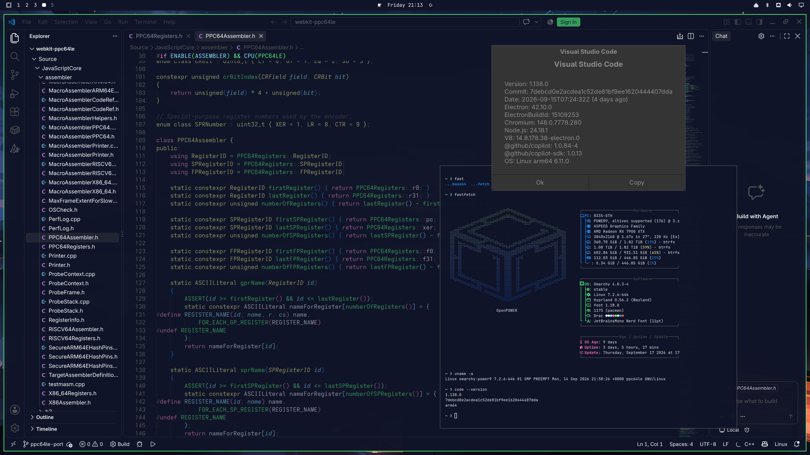

<p align="center">
  <picture>
    <source media="(prefers-color-scheme: dark)" srcset="docs/powerarm/assets/logo/powerarm-lockup-horizontal-dark.png">
    
  </picture>
</p>

<p align="center">
[](LICENSE)
-2f4f7f)


</p>

**Run AArch64 Linux programs on POWER.** POWERarm is a user-mode emulator for **ppc64le** hosts
(POWER8 and later). It translates AArch64 machine code to POWER machine code at run time, runs
programs from an AArch64 root filesystem, and can register with `binfmt_misc` so AArch64 binaries
start like native ones.

## Status

**Experimental.** Correctness is checked instruction by instruction and program by program
against a real Cortex-A76 (Raspberry Pi 5), on both 64K and 4K page-size POWER kernels.

| Milestone | State |
|---|---|
| **M1:** static AArch64 programs (glibc and musl, busybox, TinyCC) | ✅ output identical to the reference |
| **M2:** Arch Linux ARM's own GCC builds zlib and Lua | ✅ every object and binary byte-identical to the reference |
| Optimization round 1 (branches, register use, code shape, translation speed, code cache, startup) | ✅ merged |
| NEON SIMD optimizations (vectorized shifts, 64-bit VMov, unsigned compares, pairwise reductions, ISA 3.0 vabsdu*) | ✅ merged; exact POWER9 lowerings with verified POWER8 fallbacks |
| Larger real-world programs: JIT-based language runtimes | ✅ the aarch64 Claude Code CLI (Bun / JavaScriptCore) runs day to day, and code-server 4.137 (VS Code on Node 24 / V8) serves its workbench and runs its extension host |
| Desktop apps: VS Code | ✅ Microsoft's arm64 VS Code 1.138 (Electron 42, Chromium 148, Node 24): the workbench, extensions and the integrated terminal. Chromium's sandbox is off (`--no-sandbox`) for now |
| GPU | ✅ Vulkan and OpenGL run unthunked through the guest's own Mesa (RADV, radeonsi). `vkcube` matches the native frame rate |
| Games | ✅ SuperTuxKart, Arch Linux ARM's aarch64 build, runs its benchmark at around 100 fps on an RX 7900 XTX. MangoHud for guests shows frame rate, GPU load and live JIT statistics |
| Two-tier root filesystem | ✅ a read-only base plus a per-user writable layer; the guest's own `pacman` installs packages into it |
| Library thunks (Vulkan, GL, libc string and math routines) | 🔄 the guest-to-host call path and callbacks have landed; shipping the guest vDSO by default is next |
| Further performance work (code shape, flags, translation speed, code cache coverage) | 🔄 in progress; ranked goals in [`docs/powerarm/research/`](docs/powerarm/research/) |

<p align="center">
  
</p>
<p align="center"><sub>Microsoft's arm64 VS Code on a POWER9 workstation (Omarchy, RX 7900 XTX), editing the
JavaScriptCore PPC64 assembler. The About box reports <code>Linux arm64</code>; <code>uname</code> in the native
terminal beside it reports <code>ppc64le</code>.</sub></p>

**Presented CPU:** Cortex-A76 class, with
`fp asimd aes pmull sha1 sha2 crc32 atomics fphp asimdhp cpuid`. FEAT_LSE atomics are implemented
in full and advertised through `AT_HWCAP`, `ID_AA64ISAR0_EL1` and `/proc/cpuinfo` alike; there is
no SVE or SME. The EL0-readable generic timer (`CNTVCT_EL0`, `CNTFRQ_EL0`) is present, which is
what JavaScript engines use as their high-resolution clock.

## Requirements

- **Host:** a ppc64le POWER8 or newer machine. POWER9 (ISA 3.0) fast paths are selected at run time
  from `AT_HWCAP2`, and every one has a POWER8 fallback.
- **Kernel:** Linux with 4K or 64K pages.
- **Build:** clang (GCC isn't supported for building), CMake, Ninja. See
  [`docs/DEPENDENCIES.md`](docs/DEPENDENCIES.md).

## Build

```sh
git submodule update --init --recursive
CC=clang CXX=clang++ cmake -S . -B build-powerarm -GNinja \
  -DCMAKE_BUILD_TYPE=Release -DBUILD_THUNKS=OFF -DBUILD_TESTING=OFF
ninja -C build-powerarm
```

## Use

1. **Root filesystem.** Build the pinned Arch Linux ARM sysroot, with no root needed. See
   [`Scripts/powerarm/rootfs/README.md`](Scripts/powerarm/rootfs/README.md). It lands in
   `~/.local/share/powerarm/RootFS/ArchLinuxARM-m2/`.
2. **Configuration.** Create `~/.config/powerarm/Config.json`:
   ```json
   { "Config": { "RootFS": "ArchLinuxARM-m2" } }
   ```
3. **Run:**
   ```sh
   POWERarm /usr/bin/uname -m        # prints aarch64
   POWERarm /path/to/aarch64-program
   ```
4. **Optional:** register `binfmt_misc` (needs root) with the generated
   `build-powerarm/Data/binfmts/POWERarm-aarch64.conf`, so AArch64 binaries run directly. The
   entry uses the `F` flag, so re-register after rebuilding.

Options are `POWERARM_*` environment variables or `Config.json` keys. The code cache is on by
default for root filesystem binaries; `POWERARM_ENABLECODECACHINGWIP=0` turns it off.

**Installing more guest software.** A directory `<rootfs>-overlay` next to a root filesystem
(`~/.local/share/powerarm/RootFS/<name>-overlay/`) turns on a per-user
writable layer. Guest `pacman` installs into it, and the base stays unchanged. See
[`Scripts/powerarm/rootfs/README.md`](Scripts/powerarm/rootfs/README.md) and `DESIGN.md` §6.2a.

**Metrics.** With `POWERARM_PROFILESTATS=1`, the emulator publishes live per-thread JIT
statistics. [`Scripts/powerarm/shmstats.py`](Scripts/powerarm/shmstats.py) logs them to CSV,
and [`Scripts/powerarm/mangohud/`](Scripts/powerarm/mangohud/) builds MangoHud for guests with a
panel that shows them in game.

## Documentation

| Document | Contents |
|---|---|
| [`HANDOVER.md`](HANDOVER.md) | current state, working practices and the traps that cost time |
| [`docs/powerarm/DESIGN.md`](docs/powerarm/DESIGN.md) | architecture and design decisions |
| [`docs/powerarm/M1-PLAN.md`](docs/powerarm/M1-PLAN.md), [`M2-PLAN.md`](docs/powerarm/M2-PLAN.md) | milestones, exit criteria, results |
| [`docs/powerarm/OPTIMIZATION-CHECKLIST.md`](docs/powerarm/OPTIMIZATION-CHECKLIST.md) | measured optimization work and queue |
| [`docs/powerarm/CODE-CACHE.md`](docs/powerarm/CODE-CACHE.md) | code cache design and correctness tests |
| [`docs/powerarm/THUNKS-DESIGN.md`](docs/powerarm/THUNKS-DESIGN.md) | library thunks: guest-to-host calls, callbacks, the guest vDSO |
| [`docs/powerarm/research/`](docs/powerarm/research/) | POWER9 pipeline, scalar FP and NEON lowering, cold translation cost and warm code quality research |
| [`unittests/A64Diff/README.md`](unittests/A64Diff/README.md) | differential test harness (64K and 4K KVM) |

## Acknowledgements

POWERarm builds on two projects:

- **[FEX-Emu](https://github.com/FEX-Emu/FEX)** provides the JIT core, IR, Linux emulation layer,
  thunk generator and rootfs tooling. Thanks to Ryan Houdek and all FEX-Emu contributors. The
  upstream README is kept as [`README.upstream.md`](README.upstream.md).
- **[fastppcx86](https://github.com/daedalao/fastppcx86)** provides the PPC64LE JIT backend and code
  emitter, 64K page support, and the self-modifying-code subsystem for POWER.

The A64 decoder table comes from [dynarmic](https://github.com/lioncash/dynarmic) (0BSD); see
[`THIRD_PARTY.md`](THIRD_PARTY.md).

## License

MIT. See [`LICENSE`](LICENSE).

Arm is a trademark of Arm Limited and POWER is a trademark of IBM. POWERarm is an independent
project, not affiliated with or endorsed by either.
