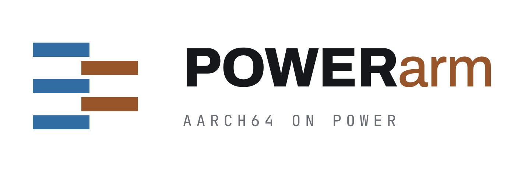

<p align="center">
  <picture>
    <source media="(prefers-color-scheme: dark)" srcset="docs/powerarm/assets/logo/powerarm-lockup-horizontal-dark.png">
    
  </picture>
</p>

<p align="center">

[](LICENSE)
-2f4f7f)


</p>

**Run AArch64 Linux programs on POWER.** POWERarm is a user-mode emulator for **ppc64le** hosts
(POWER8 and later). It translates AArch64 machine code to POWER machine code at run time, runs
programs from an AArch64 root filesystem, and can register with `binfmt_misc` so AArch64 binaries
start like native ones.

## Status

**Experimental.** Correctness is checked instruction by instruction and program by program
against a real Cortex-A76 (Raspberry Pi 5), on both 64K and 4K page-size POWER kernels.

| Milestone | State |
|---|---|
| **M1:** static AArch64 programs (glibc and musl, busybox, TinyCC) | ✅ output identical to the reference |
| **M2:** Arch Linux ARM's own GCC builds zlib and Lua | ✅ every object and binary byte-identical to the reference |
| Optimization round 1 (branches, register use, code shape, translation speed, code cache, startup) | ✅ merged |
| Larger real-world programs | 🟡 the aarch64 Claude Code CLI (Bun) runs `--version` and `--help`; its installer still fails |
| GPU and library thunks (Vulkan, GL, OpenSSL) | ⬜ planned |
| Further performance work (ahead-of-time translation, faster cache install, compute lowerings) | 🔄 in progress |

**Presented CPU:** Cortex-A76 class, with `fp asimd fphp asimdhp aes pmull sha1 sha2 crc32 cpuid`.
There's no SVE, SME or LSE yet.

## Requirements

- **Host:** a ppc64le POWER8 or newer machine. POWER9 (ISA 3.0) fast paths are selected at run time
  from `AT_HWCAP2`, and every one has a POWER8 fallback.
- **Kernel:** Linux with 4K or 64K pages.
- **Build:** clang (GCC isn't supported for building), CMake, Ninja. See
  [`docs/DEPENDENCIES.md`](docs/DEPENDENCIES.md).

## Build

```sh
git submodule update --init --recursive
CC=clang CXX=clang++ cmake -S . -B build-powerarm -GNinja \
  -DCMAKE_BUILD_TYPE=Release -DBUILD_THUNKS=OFF -DBUILD_TESTING=OFF
ninja -C build-powerarm
```

## Use

1. **Root filesystem.** Build the pinned Arch Linux ARM sysroot, with no root needed. See
   [`Scripts/powerarm/rootfs/README.md`](Scripts/powerarm/rootfs/README.md). It lands in
   `~/.local/share/powerarm/RootFS/ArchLinuxARM-m2/`.
2. **Configuration.** Create `~/.config/powerarm/Config.json`:
   ```json
   { "Config": { "RootFS": "ArchLinuxARM-m2" } }
   ```
3. **Run:**
   ```sh
   POWERarm /usr/bin/uname -m        # prints aarch64
   POWERarm /path/to/aarch64-program
   ```
4. **Optional:** register `binfmt_misc` (needs root) with the generated
   `build-powerarm/Data/binfmts/POWERarm-aarch64.conf`, so AArch64 binaries run directly. The
   entry uses the `F` flag, so re-register after rebuilding.

Options are `POWERARM_*` environment variables or `Config.json` keys. The code cache is on by
default for root filesystem binaries; `POWERARM_ENABLECODECACHINGWIP=0` turns it off.

## Documentation

| Document | Contents |
|---|---|
| [`docs/powerarm/DESIGN.md`](docs/powerarm/DESIGN.md) | architecture and design decisions |
| [`docs/powerarm/M1-PLAN.md`](docs/powerarm/M1-PLAN.md), [`M2-PLAN.md`](docs/powerarm/M2-PLAN.md) | milestones, exit criteria, results |
| [`docs/powerarm/OPTIMIZATION-CHECKLIST.md`](docs/powerarm/OPTIMIZATION-CHECKLIST.md) | measured optimization work and queue |
| [`docs/powerarm/CODE-CACHE.md`](docs/powerarm/CODE-CACHE.md) | code cache design and correctness tests |
| [`docs/powerarm/research/`](docs/powerarm/research/) | POWER9 pipeline, scalar FP and NEON lowering research |
| [`unittests/A64Diff/README.md`](unittests/A64Diff/README.md) | differential test harness (64K and 4K KVM) |

## Acknowledgements

POWERarm builds on two projects:

- **[FEX-Emu](https://github.com/FEX-Emu/FEX)** provides the JIT core, IR, Linux emulation layer,
  thunk generator and rootfs tooling. Thanks to Ryan Houdek and all FEX-Emu contributors. The
  upstream README is kept as [`README.upstream.md`](README.upstream.md).
- **[fastppcx86](https://github.com/daedalao/fastppcx86)** provides the PPC64LE JIT backend and code
  emitter, 64K page support, and the self-modifying-code subsystem for POWER.

The A64 decoder table comes from [dynarmic](https://github.com/lioncash/dynarmic) (0BSD); see
[`THIRD_PARTY.md`](THIRD_PARTY.md).

## License

MIT. See [`LICENSE`](LICENSE).

Arm is a trademark of Arm Limited and POWER is a trademark of IBM. POWERarm is an independent
project, not affiliated with or endorsed by either.
